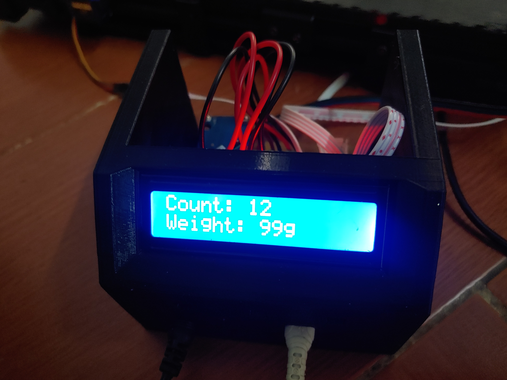
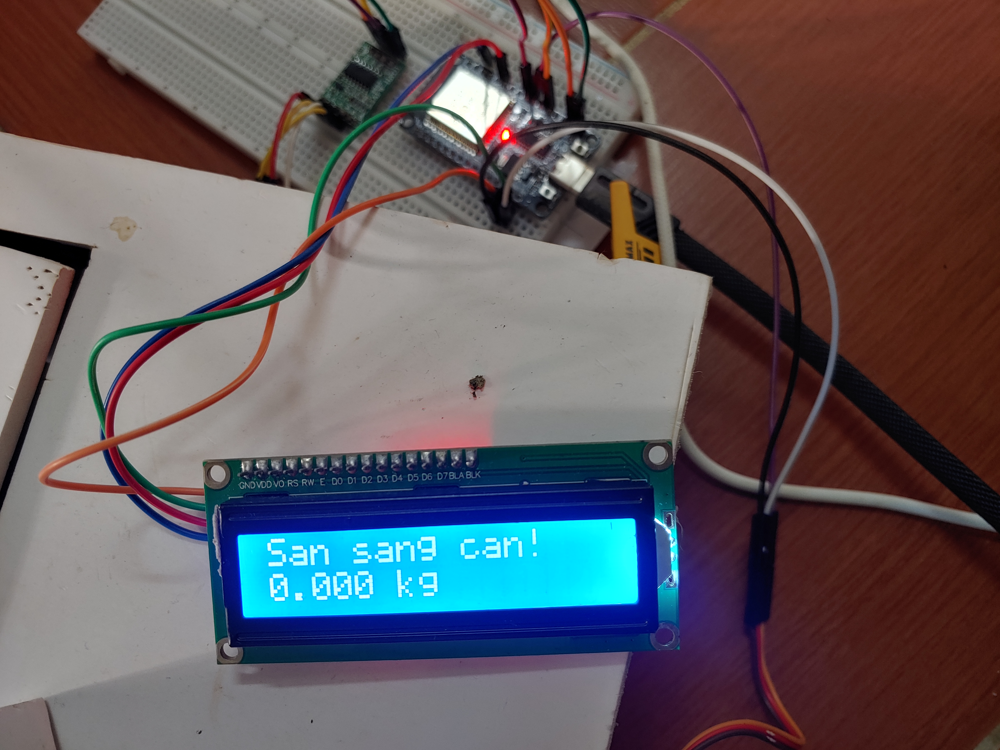
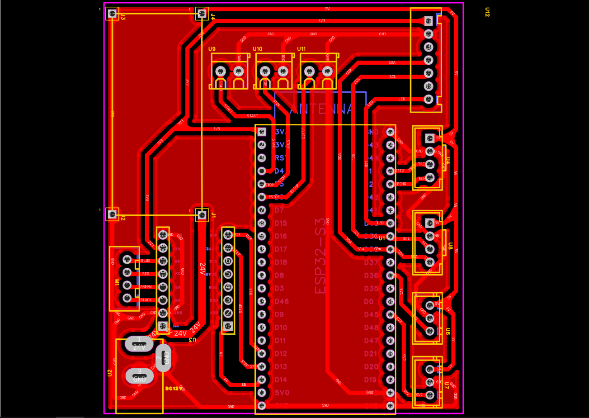
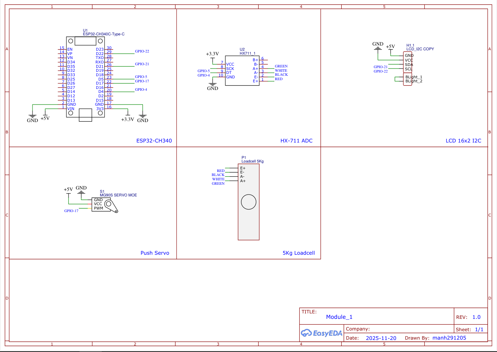

# Weight Sorting System

This project is a weight-based product sorting system built with two microcontroller modules communicating via ESP-NOW.

**Product Demo:** [Watch on YouTube](https://youtube.com/shorts/_zraOCX1zNk)

## The Team

This project was developed by a team of three. My primary responsibility was coding the conveyor and sorting mechanism (Module 2) and establishing communication between the two modules.

## Product Images

| | | |
|:---:|:---:|:---:|
|  |  |  |

## How It Works

The system consists of two main modules:

1.  **Module 1 (Weighing & Sending):**
    *   Uses a Loadcell and an HX711 module to weigh the product.
    *   The weight data (e.g., `Khoi_luong:...g`) is transmitted via the ESP-NOW protocol.

2.  **Module 2 (Conveyor & Sorting):**
    *   Receives weight data from Module 1 via ESP-NOW.
    *   Products move along a conveyor belt, passing an HC-SR04 ultrasonic sensor for counting.
    *   Based on the received weight data, a servo sorts the product into different bins.

## Project Structure

*   `./Weight_sensor-main`: Contains the source code for **Module 1**.
*   `./Conveyor sorting system`: Contains the source code for **Module 2**.

## Hardware Components

### Module 1 (SENDER)
*   **Board:** ESP32
*   **MAC Address:** `20:E7:C8:67:39:70`
*   **Components:**
    *   Loadcell
    *   HX711 Amplifier Module
    *   I2C LCD
    *   MG996r Servo

### Module 2 (RECEIVER)
*   **Board:** ESP32-S3
*   **MAC Address:** `10:20:BA:49:CD:D0`
*   **Components:**
    *   NEMA 17 Stepper Motor
    *   TMC2209 Stepper Motor Driver
    *   2 x SG90 Servos
    *   HC-SR04 Ultrasonic Sensor
    *   XL4005 DC-DC Buck Converter
    *   I2C LCD

## Development Environment

The code for this project was written using the **PlatformIO IDE** in **Visual Studio Code**.

## Schematics

The schematic (`Sch_conveyor_sorting.png`) was originally designed for a color sorting project but was adapted for this weight sorting system.

.png)

